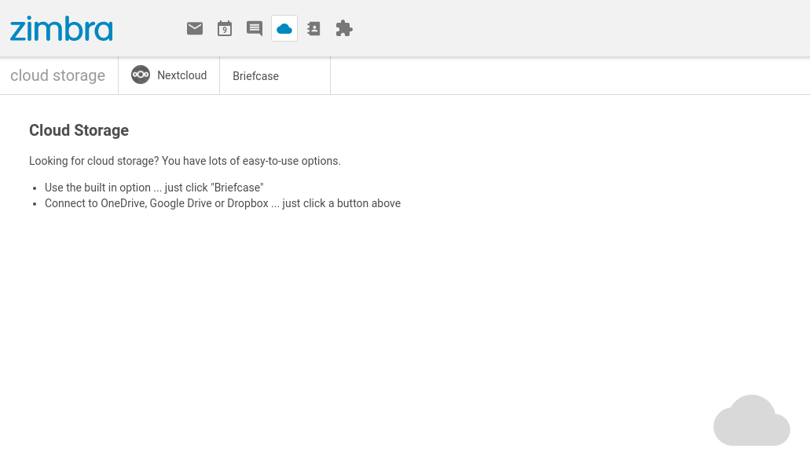
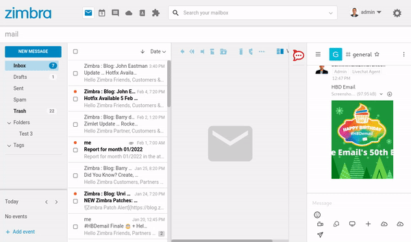

# Cloudapps briefcase redirect

With this Zimlet administrators can change the behaviour of the navigation buttons in Zimbra Modern UI. This Zimlet will bypass this screen:



So when the user clicks on the cloud icon, the user will go directly to Briefcase. See additional videos in the documentation folder and animated gif images below:

> 
*Before installing Zimlet, it takes 2 clicks to go to Briefcase*

> 
*After installing Zimlet, it takes 1 click to go to Briefcase*

## Cookbook example

This Zimlet can also be modified to work in other verticals to set for example the default chat application. See the code to get an idea of how it works.

```
//Load components from Zimbra
import { route } from 'preact-router';

//Create function by Zimbra convention
export default function Zimlet(context) {
	//Get the 'plugins' object from context and define it in the current scope
	const { plugins } = context;
	const exports = {};

	exports.init = function init() {
		plugins.register("slot::routes", RouteCloudApps);

		function RouteCloudApps() {
			if(parent.window.location.pathname==='/modern/cloudapps')
			{
				route('/cloudapps/briefcase');
			}
		}
	};

	return exports;
}
```

To make your own version please see the development guides: https://wiki.zimbra.com/wiki/DevelopersGuide
